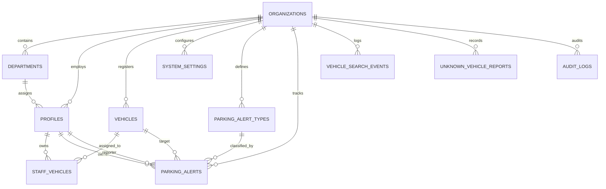

# حَرِّك | HARRIK — Database Architecture & ER Documentation

## Overview

The database is built on PostgreSQL 17 via Supabase with version-controlled migrations under `supabase/migrations/`.

---

## Entity Relationship Summary

---

## Core Tables

### 1. `organizations`
Primary tenant boundary.
- `id` (UUID, PK)
- `name_en` (TEXT)
- `name_ar` (TEXT)
- `logo_url` (TEXT)
- `country_code` (TEXT, default 'QA')
- `default_language` (TEXT, 'ar' | 'en')
- `timezone` (TEXT, default 'Asia/Qatar')
- `created_at`, `updated_at` (TIMESTAMPTZ)

### 2. `departments`
School organizational departments.
- `id` (UUID, PK)
- `organization_id` (UUID, FK -> organizations)
- `name_en`, `name_ar` (TEXT)
- `code` (TEXT, Unique per organization)
- `is_active` (BOOLEAN)

### 3. `profiles`
Staff members, teachers, security, and administrators (linked to `auth.users`).
- `id` (UUID, PK -> auth.users)
- `organization_id` (UUID, FK -> organizations)
- `employee_id` (TEXT, Unique per organization)
- `name_en`, `name_ar` (TEXT)
- `mobile` (TEXT)
- `department_id` (UUID, FK -> departments)
- `role` (TEXT: 'staff', 'security', 'admin', 'super_admin')
- `preferred_language` ('ar' | 'en')
- `is_active` (BOOLEAN)

### 4. `vehicles`
Registered school vehicles.
- `id` (UUID, PK)
- `organization_id` (UUID, FK -> organizations)
- `plate_number` (TEXT, Raw display format)
- `normalized_plate` (TEXT, Indexed: Arabic digits converted, punctuation stripped)
- `make`, `model`, `color` (TEXT)
- `year` (INT)
- `is_active` (BOOLEAN)

### 5. `staff_vehicles`
Multi-vehicle ownership mapping.
- `id` (UUID, PK)
- `organization_id` (UUID, FK -> organizations)
- `staff_id` (UUID, FK -> profiles)
- `vehicle_id` (UUID, FK -> vehicles)
- `is_primary` (BOOLEAN)
- `created_at` (TIMESTAMPTZ)
- Unique constraint on `(organization_id, staff_id, vehicle_id)`.

### 6. `parking_alerts`
Realtime incident lifecycle.
- `id` (UUID, PK)
- `organization_id` (UUID)
- `vehicle_id` (UUID, FK -> vehicles)
- `owner_id` (UUID, FK -> profiles)
- `reporter_id` (UUID, FK -> profiles)
- `alert_type_id` (UUID, FK -> parking_alert_types)
- `status` ('pending', 'acknowledged', 'resolved', 'cancelled')
- `message` (TEXT)
- `created_at`, `acknowledged_at`, `resolved_at` (TIMESTAMPTZ)

---

## Critical Indexes

- `vehicles (organization_id, normalized_plate)`: Fast exact & suffix lookup.
- `profiles (organization_id, employee_id)`: Rapid staff identification.
- `parking_alerts (organization_id, created_at DESC)`: Live dashboard feeds.
- `parking_alerts (organization_id, status)`: Active incidents count.
- `unknown_vehicle_reports (organization_id, status)`: Review queues.
